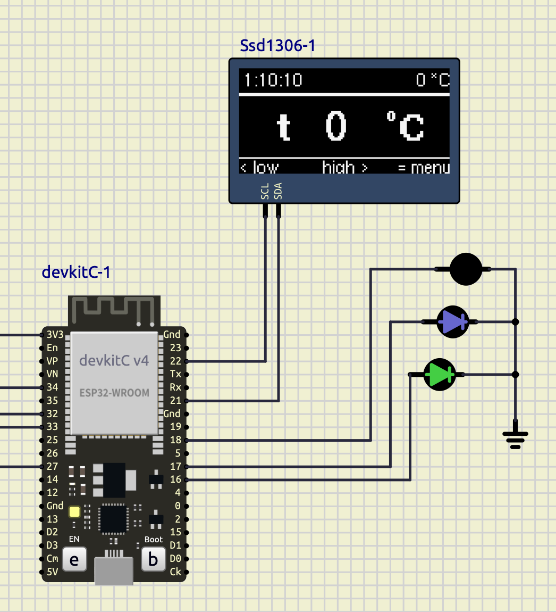

# SimulIDE

Симулятор электронных схем

**SimulIDE — простой симулятор электронных схем в реальном времени**, предназначенный для любителей и студентов, изучающих аналоговые и цифровые схемы и микроконтроллеры.
Поддерживает PIC, AVR, Arduino и другие микроконтроллеры и микропроцессоры.

**Простота, скорость и удобство** — ключевые особенности этого симулятора.
Вы можете создавать, симулировать и взаимодействовать со своими схемами за считанные минуты: просто перетащите компоненты из списка на схему, соедините их и нажмите кнопку «питание», чтобы увидеть, как всё работает.

Скорость симуляции — одна из главных характеристик этого симулятора.
Она глубоко оптимизирована для достижения отличной скорости и низкого использования процессора.

SimulIDE также включает редактор кода и отладчик для Arduino, GcBasic, PIC asm, AVR asm и других. Можно писать, компилировать и выполнять базовую отладку с точками останова, просмотром регистров и глобальных переменных.


## Сборка SimulIDE:

Зависимости для сборки:

 - Пакеты Qt5 для разработки
 - Qt5Core
 - Qt5Gui
 - Qt5Xml
 - Qt5Widgets
 - Qt5Concurrent
 - Qt5svg dev
 - Qt5 Multimedia dev
 - Qt5 Serialport dev
 - Qt5 qmake
 - Git (для загрузки QEMU-подмодуля)
 - C/C++ компилятор, python3 с pip, ninja и pkg-config
 - libgcrypt >= 1.8 (для эмуляции ESP32/STM32; macOS: `brew install libgcrypt`,
   Debian/Ubuntu: `libgcrypt20-dev`, Fedora: `libgcrypt-devel`)
 - Стандартные зависимости сборки QEMU: пакеты разработки glib-2.0 и pixman

На macOS (Homebrew) всё вышеперечисленное устанавливается так:

```
$ xcode-select --install
$ brew install qt@5 libgcrypt glib pixman ninja pkgconf python3
```

Примечание: `qt@5` — keg-only, поэтому сначала добавьте его bin в `PATH`:

```
$ export PATH="/opt/homebrew/opt/qt@5/bin:$PATH"
```

После установки инициализируйте QEMU-подмодуль из корня репозитория:

```
$ git submodule update --init --recursive
```

Затем перейдите в папку build:

```
$ qmake
$ make
```

Шаг `make` автоматически собирает бинарники QEMU-эмулятора
(`qemu-system-xtensa` для ESP32 / ESP32-S3 / ESP8266,
`qemu-system-riscv32` для ESP32-C3, `qemu-system-arm` для STM32) из подмодуля
`third_party/qemu-simulide` в `resources/data/bin/` перед линковкой
бинарника SimulIDE. На macOS эмуляторы подписываются entitlement'ом
`com.apple.security.cs.allow-jit` (`scripts/qemu-jit.entitlements`); без
него TCG-движок QEMU завис бы при запуске на Apple Silicon. QEMU —
зависимость только времени выполнения, поэтому
сбой сборки эмулятора не останавливает основную сборку (запустите
`./scripts/build_qemu.sh` вручную, чтобы увидеть ошибку). Если бинарники уже
существуют и актуальны, этот шаг пропускается.

В папке build/executables вы найдёте исполняемый файл с именем
`simulide-YYMMDD.HHMM` (на macOS это
`build/executables/simulide-YYMMDD.HHMM.app`, с папкой данных внутри по пути
`Contents/MacOS/data`).


## Запуск SimulIDE:

Зависимости времени выполнения:

 - Qt5Core
 - Qt5Gui
 - Qt5Xml
 - Qt5svg
 - Qt5Widgets
 - Qt5Concurrent
 - Qt5 Multimedia
 - Qt5 Multimedia Plugins
 - Qt5 Serialport


Установка не требуется: поместите папку SimulIDE в любое место и запустите исполняемый файл.


## Эмуляция ESP / STM32 (QEMU):

Микроконтроллеры ESP32, ESP32-S3 (Xtensa), ESP32-C3 (RISC-V) и ESP8266
(Xtensa), а также STM32 (ARM) эмулируются форком QEMU.
Форк находится в git-подмодуле `third_party/qemu-simulide`
(https://github.com/SKSasykin/SimulIDE-qemu). Наши доработки (закоммичены
непосредственно в форк) добавляют
мост к разделяемой памяти SimulIDE, сопоставление AHB-шины с UART-FIFO,
контроллер SDIO-slave (SLC), варианты моста для ESP32-S3
(`esp32s3-simulide-bridge`) и ESP32-C3 (`esp32c3-simulide-bridge`), а также
различные исправления сборки; внешний файл патча не нужен.

Поддерживаемые контроллеры Espressif: ESP32, ESP32-S3, ESP32-C3 и ESP8266.



ROM-дампы ESP32 (`data/bin/esp/rom/bin/*.bin`) копируются автоматически из
каталога `pc-bios/` форка скриптом `scripts/build_qemu.sh` при каждой сборке,
так что добавлять или коммитить их вручную не нужно.

Для ESP32 нужен образ flash-памяти точным размером 2, 4, 8 или 16 МБ.
Рекомендуемый формат — `merged.bin`, создаваемый Arduino IDE / arduino-cli
или `esptool merge_bin` (загрузчик по адресу 0x1000, таблица разделов по
0x8000, приложение по 0x10000). App-only `firmware.bin` из PlatformIO
распознаётся автоматически и объединяется с соседними `bootloader.bin` и
`partitions.bin` в образ размером 4 МБ. SimulIDE автоматически дополняет
меньшие валидные бинарники до 4 МБ и выводит понятную ошибку, если файл
отсутствует, пуст или имеет неподдерживаемый размер. Если
сконфигурированный файл прошивки не найден, используется встроенная
примерная прошивка, так что пустая плата всё равно загрузится и начнёт
мигать: `data/bin/esp32/blink.ino.merged.bin` для ESP32,
`data/bin/esp32s3/blink.ino.merged.bin` для ESP32-S3 и
`data/bin/esp32c3/blink.ino.merged.bin` для ESP32-C3. Для ESP8266
используется встроенная прошивка `data/bin/esp8266/blink.bin`.

### Поддержка I2C и SPI для ESP

Поддерживаемые универсальные контроллеры I2C и SPI по каждому устройству
(контроллеры памяти SPI, зарезервированные под flash/PSRAM, исключены):

| Устройство | I2C | Универсальный SPI | Эмуляция в SimulIDE |
| --- | --- | --- | --- |
| ESP8266EX | Программный GPIO I2C, до 100 кГц (аппаратного контроллера нет) | 1 HSPI, master до 80 МГц / slave до 20 МГц; фиксированные GPIO15 CS, GPIO14 CLK, GPIO12 MISO, GPIO13 MOSI | Битовый I2C через GPIO; опрашиваемый HSPI master на фиксированных пинах |
| ESP32 | 2 контроллера, master/slave, 100/400 кбит/с, программируемо до 5 МГц; GPIO Matrix | SPI2/HSPI и SPI3/VSPI, master до 80 МГц; IO_MUX или GPIO Matrix | 2 опрашиваемых I2C master (FIFO/командный список) и 2 буферизованных опрашиваемых SPI master с маршрутизацией IO_MUX/matrix |
| ESP32-S3 | 2 контроллера, master/slave, 100/400 и до 800 кбит/с; GPIO Matrix | SPI2/FSPI и SPI3, master до 80 МГц / slave до 60 МГц; SPI2 IO_MUX/matrix, SPI3 только matrix | 2 опрашиваемых I2C master (FIFO/командный список) и 2 буферизованных опрашиваемых SPI master; прямые пины SPI2 и GPIO Matrix |
| ESP32-C3 | 1 контроллер, master/slave, 100/400 и до 800 кбит/с; GPIO Matrix | SPI2/FSPI, master до 80 МГц / slave до 60 МГц; IO_MUX или matrix | 1 опрашиваемый I2C master (FIFO/командный список) и 1 буферизованный опрашиваемый SPI master; прямые пины SPI2 и GPIO Matrix |

Реализованный объём: доступ к FIFO I2C, командные списки
RSTART/WRITE/READ/STOP/END, статус ACK/NACK, регистры статуса прерываний и
доставка прерываний; буферы данных SPI до 64 байт, `CMD.USR`,
программируемая длина данных, делитель тактов, CPOL/CPHA, порядок бит и
автоматический CS0. ESP32-S3/C3 используют современные раскладки периферии
и смещения регистров GPIO Matrix; ESP8266 не имеет вымышленного
аппаратного I2C-контроллера (программный I2C по-прежнему работает через
GPIO).

Ещё не реализовано: режим slave для I2C и SPI, DMA, доставка
прерываний SPI, фазы command/address/dummy SPI, передачи dual/quad/octal,
арбитраж и полное поведение таймингов и ошибок. Текущая реализация
ориентирована на опрашиваемые master-драйверы. Полная таблица и ссылки на
официальную документацию Espressif — в
[docs/esp-i2c-spi-support.md](docs/esp-i2c-spi-support.md).

### Поддержка АЦП для ESP

АЦП всех поддерживаемых контроллеров Espressif эмулируются с точными по
datasheet соответствиями «канал → GPIO» и эффективными диапазонами
измерения. Напряжение на выбранном GPIO-пине считывается напрямую из
аналоговой схемы и масштабируется под выбранное ослабление и разрядность.

| Устройство | Блок АЦП | Каналы | Соответствие «канал → GPIO» | Диапазон при ослаблении (В), коды 0-3 | Разрядность |
| --- | --- | --- | --- | --- | --- |
| ESP8266EX | один SAR | 1 (TOUT) | A0/TOUT | фикс. 0-1 В | 10 бит, 8 выборок SAR |
| ESP32 | ADC1 | 8 (CH0-7) | GPIO36, GPIO37, GPIO38, GPIO39, GPIO32, GPIO33, GPIO34, GPIO35 | 0.95, 1.25, 1.75, 2.45 | программируемая 9/10/11/12 бит |
| ESP32 | ADC2 | 10 (CH0-9) | GPIO4, GPIO0, GPIO2, GPIO15, GPIO13, GPIO12, GPIO14, GPIO27, GPIO25, GPIO26 | 0.95, 1.25, 1.75, 2.45 | программируемая 9/10/11/12 бит |
| ESP32-S3 | ADC1 | 10 (CH0-9) | GPIO1 .. GPIO10 | 0.85, 1.10, 1.60, 2.90 | фикс. 12 бит |
| ESP32-S3 | ADC2 | 10 (CH0-9) | GPIO11 .. GPIO20 | 0.85, 1.10, 1.60, 2.90 | фикс. 12 бит |
| ESP32-C3 | ADC1 | 5 (CH0-4) | GPIO0 .. GPIO4 | 0.75, 1.05, 1.30, 2.50 | фикс. 12 бит |
| ESP32-C3 | ADC2 | 1 (CH0) | GPIO5 | 0.75, 1.05, 1.30, 2.50 | фикс. 12 бит |

Примечания к реализации:

- Обращения к регистрам АЦП передаются из QEMU в SimulIDE через мост,
  который устанавливает узкое MMIO-окно над блоком АЦП каждого чипа
  (SENS ESP32 по адресу `0x3FF48800`, SENS ESP32-S3 по адресу
  `0x60008800`, APB_SARADC ESP32-C3 по адресу `0x60040000`, SAR ESP8266
  по адресу `0x60000D00`).
- Моделируется опрашиваемый поток: при `meas_start` с установленным битом
  запуска выбранный канал преобразуется, а сырое значение и флаг готовности
  публикуются обратно в регистр запуска, поэтому
  `adc_ll_rtc_convert_is_done()` / `adc_ll_rtc_get_convert_value()` работают.
- Разрядность классического ESP32 программируется (9/10/11/12 бит) через
  регистр SENS со смещением `0x2C`; ESP32-S3 и ESP32-C3 — фиксированные
  12 бит.
- ESP8266 имеет внешний пин `A0/TOUT` (диапазон 0-1 В) и записывает восемь
  слотов результата SAR в совместимой с SDK кодировке, используемой
  `analogRead()`.

Известные ограничения: не моделируются аппаратная ошибка (errata)
ESP32-C3 ADC2_CH0, конкуренция ESP32 ADC2 с Wi-Fi и измерение внутреннего
напряжения питания ESP8266. Полные подробности и ссылки на официальную
документацию Espressif — в [docs/esp-adc-support.md](docs/esp-adc-support.md).

### Поддержка PWM (LEDC) для ESP

PWM-контроллеры LEDC поддерживаемых контроллеров Espressif эмулируются с
точными по datasheet количеством каналов, группами таймеров, картами
регистров и индексами сигналов GPIO-матрицы. Как и на реальном железе,
любой канал можно маршрутизировать на любой GPIO-пин через GPIO-матрицу.

| Устройство | Модуль PWM | Каналы | Таймеры | Разрешение duty | Счётчик | Регистр DUTY | База регистров | Сигналы GPIO-матрицы | Поддержка в SimulIDE |
| --- | --- | --- | --- | --- | --- | --- | --- | --- | --- |
| ESP8266EX | нет (только программный PWM) | — | — | ~8-10 бит (soft) | — | — | — | — | аппаратного PWM нет, не эмулируется |
| ESP32 | LEDC | 16 (8 HS + 8 LS) | 8 (4 HS + 4 LS) | до 25 бит | 20 бит | 25 бит (21 цел + 4 дроб) | 0x3FF59000 | 71-86 | полная |
| ESP32-S3 | LEDC | 8 (LS) | 4 | до 14 бит | 14 бит | 19 бит (15 цел + 4 дроб) | 0x60019000 | 73-80 | полная |
| ESP32-C3 | LEDC | 6 (LS) | 4 | до 14 бит | 14 бит | 19 бит (15 цел + 4 дроб) | 0x60019000 | 45-50 | полная |

Примечания к реализации:

- Частота PWM моделируется точно:
  `f_PWM = clk · 256 / (clock_divider · 2^duty_res)` с 18-битным
  делителем в формате с фиксированной точкой (8 дробных бит); duty
  берётся из старшей части регистра DUTY (`DUTY >> 4`) относительно полной
  шкалы `2^duty_res`, покрывая 0-100 %.
- Блок регистров LEDC передаётся из QEMU через мост
  (ESP32 — `0x00059000`, ESP32-S3/C3 — `0x00019000`).

Пока не реализовано: смещение HPOINT, плавное изменение duty по CONF1
(DUTY_START/DUTY_INC/DUTY_NUM/DUTY_CYCLE/DUTY_SCALE), прерывания LEDC
(INT_RAW/INT_ST/INT_ENA/INT_CLR) и источники тактирования
XTAL/RTC8M/REF_TICK (моделируются только APB-часы). У ESP8266 нет
аппаратного PWM-периферийного модуля, поэтому программный PWM ядра
Arduino (`analogWrite` через таймер FRC1) не эмулируется.
